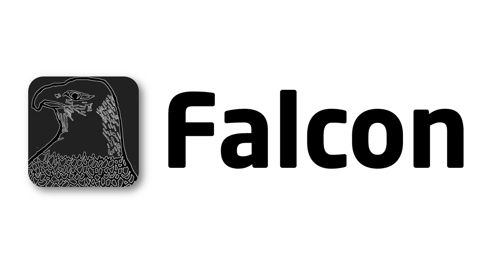

# Falcon Programming Language - Version 1.2.4
### Eric Buehler 2022 ###



Falcon is a multithreaded, multi-paradigm interpreted programming language, with a focus on readability and simplicity. It is dynamically typed, and has automatic garbage collection based on reference counting and a tri-generational garbage collector. In comparison to other languages, it a hybrid of Python and C, with the benefits of Python and the syntax of C.

Falcon is implemented in C++. However, although the compiler and virtual machines do not use object oriented features and could mostly be compiled in C, the lexer and parser make heavy use of such features.

### Builtins ###
- ```print```
- ```__build_class__```
- ```id```
- ```input```
- ```repr```
- ```iter```
- ```next```
- ```round```
- ```enumerate```
- ```range```
- ```zip```
- ```globals```
- ```locals```
- ```alllocals```
- ```len```
- ```copyright```
- ```exit```
- ```isinstance```
- ```eval```
- ```super```
- ```getattr```
- ```setattr```
- ```iscallable```
- ```reverse```
- ```isiter```
- ```min```
- ```max```
- ```map```
- ```abs```
- ```method```
- ```classmethod```
- ```staticmethod```
- ```property```
- ```getannotation```
- ```sum```
- ```hasattr```
- ```dir```
- ```bin```
- ```hex```
- ```ord```
- ```chr```
- ```unicode_name```

### Builtin libraries ###
- ```time```
- ```math```
- ```random```
- ```threading```
- ```sys```
- ```os```
- ```sockets```
- ```simpleserver```
- ```builtins```
- ```json```

<details>
<summary>Exceptions</summary>

- ```Exception```
- ```TypeError```
- ```ValueError```
- ```AttributeError```
- ```KeyError```
- ```NameError```
- ```IndexError```
- ```MemoryError```
- ```RecursionError```
- ```StopIteration```
- ```FileNotFoundError```
- ```InvalidOperationError```
- ```ImportError```
- ```KeyboardInterrupt```
- ```AssertionError```
- ```ZeroDivisionError```
    
</details>    

### Keywords ###
- ```func```
- ```class```
- ```return```
- ```if```
- ```else```
- ```elif```
- ```raise```
- ```try```
- ```except```
- ```finally```
- ```for```
- ```break```
- ```while```
- ```import```
- ```from```
- ```del```
- ```assert```
- ```continue```
- ```lambda```
- ```yield```
- ```with```

### Other syntax ###
- ```:``` - Global variable access
- ```::``` - Nonlocal variable access
- ```<name>``` : ```<type>``` - Type annotations in function arguments or assignment
- ```<function definition> : <type> {``` - Type annotation for function return value
- ```f"Text {code}"``` - Format strings using code snippets
- ```b"Text"``` - Creates a bytes object from string
- ```\uXXX``` - Unicode escape, where ```XXXX``` represents a 4 digit hexadecimal string (mandatory)
- ```\N...``` - Unicode name literal, where ```...``` represents a valid name that represents a unicode code point

### Documentation ##
- [Dunder Attributes](https://github.com/EricLBuehler/Falcon-Programming-Language/blob/main/docs/DUNDER_ATTRS.md)
- [Types of functions](https://github.com/EricLBuehler/Falcon-Programming-Language/blob/main/docs/FUNCTIONS.md)
- [Equivalent C++ Types to Falcon Types](https://github.com/EricLBuehler/Falcon-Programming-Language/blob/main/docs/TYPE_CPPBASE.md)
- [Builtin type methods](https://github.com/EricLBuehler/Falcon-Programming-Language/blob/main/docs/TYPE_DOCS.md)
- [Conventions](https://github.com/EricLBuehler/Falcon-Programming-Language/blob/main/docs/CONVENTIONS.md)
- [Builtin Functions](https://github.com/EricLBuehler/Falcon-Programming-Language/blob/main/docs/BUILTINS.md)

### Sample Program ###

<details>
<summary>Program</summary>

```js
m="Placeholder value"

class Falcon{
    var=m
    func sound(self){
        print("Sound!")
    }
}


class Peregrine(Falcon){
    var=m
    func __new__(self){
        print("__new__ called")
        return super(self).__new__(self)
    }
    func __init__(self){
        print(self)
    }
    func f(self){
        print(self.var)
    }
}

x=Peregrine()

y=Peregrine()

a=Peregrine.var
x.var=5
y.var="Value"
b=x.var

x.f()
y.f()

x.sound()

print(x.__bases__)

func f(x,c="A"){
    print("Function f says: ","")
    print(c)
}

f(1)


dictionary={1:[1,2,3], 2:{1:"A"}, "Hello":"World", [123]:2}

l=list(1,2,3,4,5)

x=object()
y=object()


true = x == y
maybe = x is y
same = x is x
print(500==500)


print("Done")

print(l[3])
print(dictionary[[123]])


try{
    if 500 is 200{
        raise Exception("500 is not the same object as 200")
    }
    elif 500 is 500{
        raise TypeError("500 is not the same object as 200, but is the same as 500")
    }
    else{
        raise NameError("Else condition reached")
    }
}
except Exception e{
    print(e)
}

i=0

func x(){
    i=i+1

    print(i)
    if (i==3){
        raise ValueError("I is 50!")
    }
    x()
}

try{
    x()
}
except Exception e{
    print(e)
}

val=2
print(val.__mul__(5))

func fib(n){
    if (n<=1){
        return n
    }
    else{
        return fib(n-1)+fib(n-2)
    }
}

print(fib(10))

pi=238649.2131693410000000
x=pi*100
print(str(pi))
print(int("1234"))
print(float("10.222"))

for n in [10,20,30]{
    print(n)
}

i=0
while i<10{
    print(i)
    i+=1
}

print(True and False)
print(True or False)
print(not 1==1)

print(100^2)
print(100^2*3)
print(100^6)
```

</details>

When run with ```./fpl.exe program.fpl```

<details>
<summary>Output</summary>

```
__new__ called        
<Peregrine @ 0xba7a98>
__new__ called        
<Peregrine @ 0xba7b40>
5
Value
Sound!
[<class 'Falcon'>, <class 'object'>]
Function f says:  
A
True
Done
4
2
500 is not the same object as 200, but is the same as 500
1
2
3
I is 50!
10
55
238649.213169341
1234
10.222
10
20
30
False
True
False
102
98
98
```

</details>

### Usage ###
Build Falcon in debug mode
```./build.cmd```

Build Falcon in release mode
```./release.cmd```

Run a script
```./fpl program```

Enter REPL
```./fpl```

Help
```./fpl -h```

### Links ###
- <a href='https://github.com/dannyvankooten/pepper-lang'>Pepper Lang</a>
- <a href='https://github.com/davidcallanan/py-myopl-code'>py-myopl-code</a>
- <a href='https://github.com/faheel/BigInt'>BigInt</a> (Used for ```int``` type)
- <a href='https://github.com/python/cpython'>CPython</a>
- <a href='https://eli.thegreenplace.net/2012/07/12/computed-goto-for-efficient-dispatch-tables'>Computed GOTOs</a>
- <a href='https://github.com/thestr4ng3r/nxjson'>NXJSON</a>

### Licenses ###
- [MIT License](LICENSE)
- [BigInt - MIT License](https://github.com/EricLBuehler/Falcon-Programming-Language/blob/main/object/BigInt.hpp)
